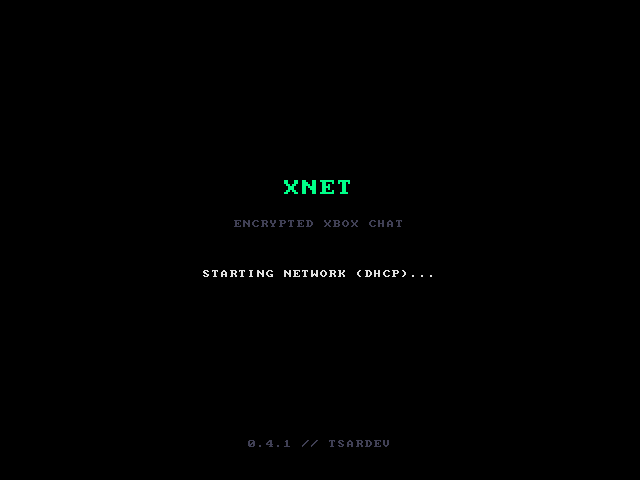
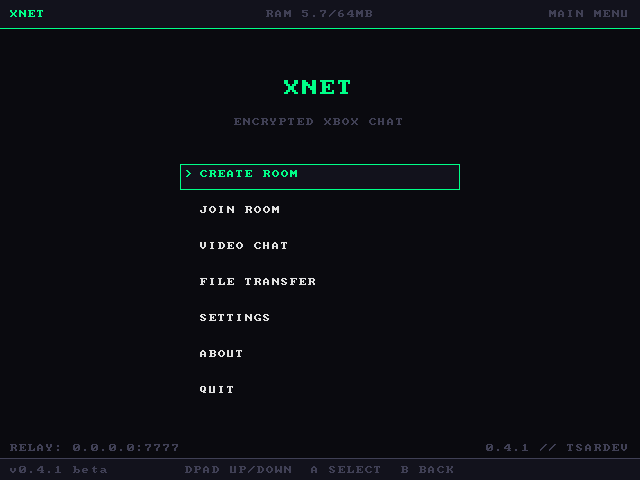
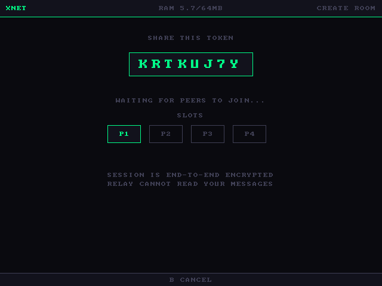

# XNET

**End-to-end encrypted text, voice, file, and video communication for the original Xbox.**

<p align="center">
  
</p>

`v0.4.1 public beta` · Built with [NXDK](https://github.com/XboxDev/nxdk) · *Privacy by Design*

XNET turns a retail original Xbox into a secure communicator. Up to four
consoles anywhere in the world can chat, talk, send files, and see each other on
camera — all encrypted end-to-end, routed through a relay that can never read a
single byte of it.

> ✅ **Runs on a stock, unmodified 64 MB retail Xbox.**
> No RAM upgrade, no developer hardware, no special revision required. If your
> console runs homebrew, it runs XNET — camera video included.

---

## Downloads

- [XNET-v0.4.1 ISO](_deployments/XNET.iso)
- [XNET-v0.4.1 XISO](_deployments/XNET.xiso)
- [XNET-v0.4.1 XBE Package](_deployments/XNET.zip)

## SHA-256 Checksums

Verify your downloads using the following SHA-256 hashes

```sh
XNET.iso
SHA-256: e2ca7570b1ec4f1a4c806df430cadafaca4e238c9c5f2bb0e83939e72cb47e41
```

```sh
XNET.xiso
SHA-256: 85d3413bc4d6ceef17d4215a410e94977e2b73ff9fff17539bb23bc9ac050dce
```

```sh
XNET.zip
SHA-256: 2e9cfe4212b6b4e7863994d58b8adfdfa0c40e6ad4f9cd223f818c25706c34f4
```

## Features

- **Encrypted text chat** — type from an on-screen keyboard.
- **Real-time voice chat** — open-mic voice over an Xbox Communicator or Hawk adapter and headset.
- **Secure video chat** — live camera video from a PS2 EyeToy or Xbox camera, up to four tiles.
- **Encrypted file transfer** — send files console-to-console.
- **Authenticated encryption** — AES-128-CBC with HMAC-SHA-256 (encrypt-then-MAC).
- **Zero-knowledge relay** — the server blindly forwards encrypted packets and
  stores nothing.
- **Zero persistence** — rooms live only in memory and vanish when they end. No
  accounts, no friend lists, no cloud, no logs on the relay.
- **Built for the hardware** — fits and runs on a stock **64 MB** console at
  640×480.

---

## Requirements

### Console

- An original Xbox capable of running homebrew (softmod, modchip, or TSOP).
- **64 MB of RAM — i.e. a completely stock console.** A 128 MB debug/dev console
  works too, but is **not** required.
- A network connection (wired Ethernet; DHCP).

### Peripherals (optional, per feature)

| Feature        | Hardware                                                        |
| -------------- | --------------------------------------------------------------- |
| Text + files   | Controller only                                                 |
| Voice          | **Xbox Communicator** headset (045E:0283) — retail or Hawk; works with headsets like the Xbox 360 headset or a Logitech Pro X |
| Video          | **PS2 EyeToy** (silver US, 054C:0155) or the Japanese Xbox Video Camera (045E:028C) |

You can mix and match per console — a console with only a headset can still join
a video room and participate by voice; a console with only a camera will be seen
but silent.

### Relay

XNET needs a relay to route traffic between consoles (consoles never connect
directly to each other, so no one learns anyone else's IP). You can point at an
existing XNET relay or host your own — see **Hosting a Relay** below.

---

## Installation

1. Build `default.xbe` (see **Building from Source**) or grab a release build.
2. FTP the XNET folder to your console (for example under
   `E:\Apps\XNET\`).
3. Create a config file named `xnet.cfg` next to `default.xbe` (this is the
   `D:` launch directory at runtime) — see **Configuration**.
4. Launch XNET from your dashboard.

On boot, XNET mounts the drives, brings up USB and networking, and drops you at
the main menu. A log is written to `E:\Dashboard\system\xnet.log`.

---

## Configuration

XNET reads `xnet.cfg` from its launch directory (`D:\xnet.cfg`) at boot. All
keys are optional; anything omitted falls back to a built-in default, and
everything here can also be changed in-app from the **Settings** screen (which
writes the file back for you).

```ini
relay=your.relay.host.or.ip
port=7777
mic_gate=50000
mic_gain=100
debug_log=0
```

| Key         | Meaning                                                      |
| ----------- | ----------------------------------------------------------- |
| `relay`     | Relay hostname or IP                                         |
| `port`      | Relay port (default 7777)                                    |
| `mic_gate`  | Voice activation threshold; `0` = open mic (always transmit) |
| `mic_gain`  | Mic input gain in percent (25–200); lower it if a hot mic distorts |
| `debug_log` | `1` enables verbose per-frame logging for bug reports        |

---

## Usage

<p align="center">
  
</p>

From the main menu:

- **CREATE ROOM** — generates a room token and waits for others to join.
- **JOIN ROOM** — type a room token to enter an existing room.
- **VIDEO CHAT** — start or join a Secure Video session (camera tiles + voice).
- **FILE TRANSFER** — send or receive a file with another console.
- **SETTINGS** — relay, mic, and diagnostics (below).
- **ABOUT** — version and project info.
- **QUIT** — return to the dashboard.

**The room token is the secret.** Anyone who has it can join the room and
decrypt everything in it, so share tokens only over a channel you already trust,
and prefer long, unpredictable ones.

<p align="center">
  
</p>

### Voice

Voice is **open-mic** — just talk; there's no push-to-talk. In a video session
your own tile shows a live **MIC ON / TALKING / NO MIC** indicator so you can
confirm you're transmitting.

### Settings

- **RELAY IP / RELAY PORT** — edit the relay you connect to (saved to `xnet.cfg`).
- **MIC SENSITIVITY** — how loud you must be to transmit. A live meter shows your
  level against the gate; speak and watch the bar cross the line.
- **MIC GAIN** — input volume (25–200%). If the meter shows **CLIP** while you
  talk normally, lower the gain. (Great for hot headset mics like a Pro X.)
- **DEBUG LOGGING** — turn on a full diagnostic trace for bug reports, off for
  normal use.
- **CAMERA TEST** — local camera diagnostics, no network required.

---

## Building from Source

XNET is built with the [NXDK](https://github.com/XboxDev/nxdk) toolchain.

```sh
# install and set up NXDK first (see the NXDK docs), then:
export NXDK_DIR=/path/to/nxdk
cd _src
make
```

The build produces `bin/default.xbe`. The relay is a single Node.js file in
`_src_relay/`.

> Tip: if the build log's `build:` timestamp ever looks stale, `touch
> _src/xnet_log.c` before building — that's the file the date/time string lives
> in.

---

## Hosting a Relay

The relay (`xnet-relay.js`) is a small Node.js server. It is a **blind
forwarder**: it moves encrypted packets between the consoles in a room and
stores nothing.

```sh
node xnet-relay.js        # listens on port 7777 by default
```

Run it on any always-on host (a small VPS is plenty), point your consoles'
`relay`/`port` at it, and you're done. See **Recommendations for Relay
Operators** in the security docs for hardening notes. Please don't add content
logging — the zero-knowledge design is the point.

---

## Security

XNET encrypts all text, voice, video, and file content end-to-end with
**AES-128-CBC**, and as of v0.4.x authenticates every packet with
**HMAC-SHA-256** (encrypt-then-MAC, verified before decryption). Session keys
are derived **locally** from the room token and are never transmitted; the relay
never holds a key and cannot read traffic.

It is honest, hobbyist software for 24-year-old hardware — not an audited,
high-threat tool. Please read the full details and limitations:

- [**Security Policy**](SECURITY.md) — supported versions, threat model, and how
  to report a vulnerability.
- [**Security Architecture**](SECURITY_ARCHITECTURE.md) — key derivation, packet
  framing, the encrypt-then-MAC construction, per-feature data paths, and the
  relay design.

> **Compatibility note:** v0.4.x changed the wire format (authenticated
> encryption) and does **not** interoperate with 0.3.x. Every console in a
> session must be on the same major protocol — flash all participants to 0.4.x.

---

## Troubleshooting

- **A log is always written to** `E:\Dashboard\system\xnet.log` (boot, device,
  and connection events). It truncates on every boot, so it stays small.
- For a detailed report, enable **DEBUG LOGGING** in Settings, reproduce the
  issue, then grab the log over FTP. This WILL consume RAM on console, you may crash after long periods.
- No video tiles? Confirm the EyeToy enumerates in the log (`camera: streaming
  started`). No audio? Confirm the Communicator enumerates (`xblc: mic/spk
  streaming started`).

---

## Known Bugs

- **XEMU/DISCS** : `.xiso` && `.iso`config adjustments are not persistent, this is already addressed but NOT present currently.

---

## Source Availability and Documentation

- XNET is intentionally written with extensive inline documentation and descriptive code structure. Comments, protocol notes, and implementation details are included throughout the source to promote transparency, simplify auditing, and make the project easier for others to understand, maintain, and contribute to. This level of documentation is deliberate and reflects the project's commitment to openness and long-term preservation.

---

# Currently in Development (v0.4.5) Security Upgrades

- Work on XNET v0.4.5 is focused on continued protocol hardening and long-term security improvements. I will introduce anti-replay protection across text, voice, video, and file transfer streams through authenticated sequence numbers, sliding receive windows, and per-room session identifiers while preserving the relay's zero-knowledge design.

- Focus is also on improving initialization vector generation and exploring forward secrecy mechanisms to better isolate sessions and reduce the impact of key compromise. These enhancements are aimed at strengthening XNET's cryptographic foundation while maintaining compatibility with original Xbox hardware.

As the protocol evolves, some of these changes may introduce future wire-format updates requiring clients and relays to be upgraded together.

---

## Acknowledgments

XNET is built on [tiny-AES-c](https://github.com/kokke/tiny-AES-c),
[NXDK](https://github.com/XboxDev/nxdk), camera and USB research from the
original Xbox homebrew community, and the testers and contributors who keep the
original Xbox alive online.

Special thanks to **Team Resurgent** and **Darkone83** for their RXDK [camera research project](https://github.com/Darkone83/Xbox-live-camera-research-project)

Their work researching the original Xbox camera hardware and developing RXDK-based drivers for the OV519 chipset provided invaluable insight during the development of XNET's video subsystem. Their research greatly accelerated hardware bring-up, testing, and validation efforts.

Additional thanks to the contributors of the Xbox EyeToy project and [ConsoleMods Wiki](https://consolemods.org/wiki/Xbox:EyeToy_Mod_Guide)

- Ryzee119 — discovering and testing OV519 hardware registers and device descriptors, and identifying camera device IDs within the original Xbox Video Chat software.
- xbox7887 — research, testing, and documentation imagery.
- Harcroft — research, testing, EEPROM patching, Xbox camera teardown, and guide development.
- Libby — additional patching work.
- Luke Usher — the original idea.
- Evan Blax — English translation patch.

Their collective work preserving and documenting the original Xbox camera ecosystem made modern experimentation and compatibility efforts possible.

XNET would not exist without the collective knowledge shared by the original Xbox community over the past two decades.

*"Privacy by Design."*
